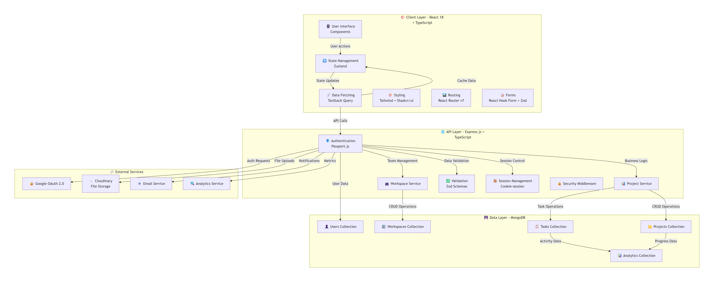

# TeamSync - Modern Team Project Management Platform
#### *TeamSync is a comprehensive B2B SaaS platform for team project management, built with modern web technologies. It provides organizations with powerful tools for workspace management, project tracking, task collaboration, and team coordination with role-based access control.*

## 🎨 Features
### 🔐 Smart Authentication
- One-click Google login - No more password headaches!
- Role-based access - Control who sees what with military precision
- Secure sessions - Your data stays safe, always

## 🏢 Workspace Wizardry

- Multiple workspaces - Keep your teams organized and focused
- Instant invitations - Get your team onboarded in seconds
- Smart permissions - Right people, right access, right now

## 📊 Project Powerhouse

- Visual task hierarchy - See your entire project at a glance
- Real-time updates - Watch progress happen live
- Smart filtering - Find exactly what you need in milliseconds

## 📈 Analytics Dashboard

- Progress tracking - Know exactly where you stand
- Team insights - Uncover productivity patterns
- Custom reports - Data that actually makes sense


## Architecture & Tech Stack
.
### Backend Stack
- Runtime: Node.js
- Framework: Express.js
- Database: MongoDB with Mongoose ODM
- Authentication: Google OAuth 2.0 + Passport.js

### Frontend Stack
- React 18 + TypeScript
- Vite.js Build Tool
- Tailwind CSS + Shadcn/ui
- TanStack Query
- React Hook Forms

## 🚀 TeamSync - Quick Start Guide
### 🎯 Prerequisites Checklist
-  Node.js (v18 or higher) installed
-  MongoDB account (or local installation)
-  Git installed on your system
-  Modern web browser (Chrome, Firefox, Safari, or Edge)

### 📥 Step 1: Clone & Setup

###  Clone the repository
``` 
git clone https://github.com/your-username/teamsync.git
cd teamsync
```

### ⚙️ Step 2: Backend Setup
```
Navigate to Backend
cd backend
Install Dependencies
bash
npm install
```
Create Environment File
Create a file named .env in the backend directory and add:
```
PORT=8000
NODE_ENV=development

MONGO_URI=

SESSION_SECRET=
SESSION_EXPIRES_IN=

GOOGLE_CLIENT_ID=
GOOGLE_CLIENT_SECRET=
GOOGLE_CALLBACK_URL=

FRONTEND_ORIGIN=
FRONTEND_GOOGLE_CALLBACK_URL=
```
Start Backend Server
```
npm run dev
```


### 🎨 Step 3: Frontend Setup
Open New Terminal & Navigate to Frontend
```
cd client
npm install
```
Create Environment File
Create a file named .env in the client directory and add:

```
VITE_API_BASE_URL="http://localhost:8000/api"
npm run dev
```
Frontend should now be running on: http://localhost:5173
