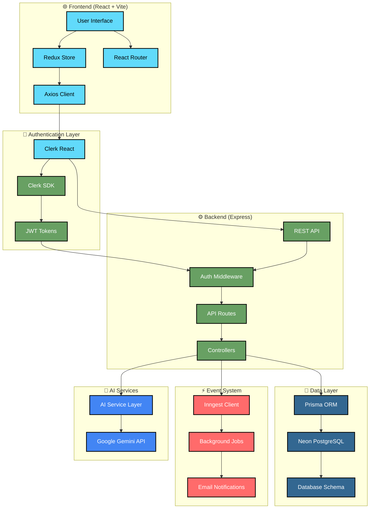

<div align="center">

# 🚀 TeamSync

### Modern Team Project Management Platform

[](https://reactjs.org/)
[](https://nodejs.org/)
[](https://www.postgresql.org/)
[](https://expressjs.com/)


A powerful SaaS platform for team project management, built with modern web technologies. TeamSync provides organizations with enterprise-grade tools for workspace management, project tracking, task collaboration, and team coordination—all powered by event-driven notifications and role-based access control.


</div>

---

## ✨ Features

### 🔐 **Enterprise Authentication**
- **Clerk Integration** - Seamless OAuth authentication with zero password management
- **Role-Based Access Control** - ADMIN/MEMBER permissions with granular workspace controls
- **Secure JWT Sessions** - Industry-standard token-based authentication
- **Lazy Sync Pattern** - Automatic user synchronization across workspaces

### 🏢 **Workspace Management**
- **Multi-Workspace Support** - Organize teams across unlimited workspaces
- **Instant Invitations** - Onboard team members in seconds with invitation system
- **Smart Permissions** - Context-aware access control for resources
- **Workspace Settings** - Customizable configurations per workspace

### 📊 **Project & Task Management**
- **Visual Task Hierarchy** - Organize tasks with project-level grouping
- **Real-Time Updates** - Live synchronization of task changes across clients
- **Smart Filtering** - Find tasks instantly with advanced search and filters
- **Task Types** - Support for Tasks, Bugs, Features, Improvements, and custom types
- **Priority Management** - Low, Medium, and High priority classification
- **Status Tracking** - TODO, IN_PROGRESS, and DONE workflow states
- **Due Date Management** - Never miss deadlines with integrated date tracking
- **Task Comments** - Collaborative discussions on individual tasks

### ⚡ **Event-Driven Notifications**
- **Instant Email Alerts** - Real-time notifications when tasks are assigned
- **Scheduled Reminders** - Automated deadline reminders
- **Background Processing** - Powered by Inngest for 99.25% faster job execution
- **Automatic Retries** - Guaranteed notification delivery with retry logic
- **SMTP Integration** - Robust email delivery via Nodemailer

### 🤖 **AI-Powered Assistance**
- **Google Gemini Integration** - AI-powered task suggestions and automation
- **Smart Task Generation** - AI assistance for creating and organizing tasks
- **Intelligent Insights** - Context-aware recommendations

### 📈 **Analytics Dashboard**
- **Progress Tracking** - Real-time project completion metrics
- **Team Insights** - Productivity patterns and team performance analytics
- **Visual Charts** - Beautiful data visualization with Recharts
- **Project Status** - Active, Planning, Completed, On Hold, and Cancelled states

---

## 🛠️ Tech Stack

### **Backend**
| Technology | Purpose |
|------------|---------|
|  | Runtime environment |
|  | Web framework |
|  | Database (Serverless) |
|  | Database ORM with Neon adapter |
|  | Authentication & user management |
|  | Background jobs & event system |
|  | Email service |
|  | AI integration |

### **Frontend**
| Technology | Purpose |
|------------|---------|
|  | UI library |
|  | Type safety |
|  | Build tool & dev server |
|  | Styling framework |
|  | State management |
|  | Client-side routing |
|  | HTTP client |
|  | Icon library |
|  | Data visualization |

### **DevOps & Deployment**
- **Docker** - Containerization with multi-stage builds
- **Docker Compose** - Local development orchestration
- **Vercel** - Frontend & backend deployment (configured)
- **GitHub Actions** - CI/CD pipeline (optional)

---

## 🏗️ Architecture


```mermaid
graph TB
    subgraph Client["🌐 Frontend (React + Vite)"]
        UI[User Interface]
        Redux[Redux Store]
        Router[React Router]
        Axios[Axios Client]
    end

    subgraph Auth["🔐 Authentication Layer"]
        ClerkUI[Clerk React]
        ClerkSDK[Clerk SDK]
        JWT[JWT Tokens]
    end

    subgraph Server["⚙️ Backend (Express)"]
        API[REST API]
        Middleware[Auth Middleware]
        Controllers[Controllers]
        Routes[API Routes]
    end

    subgraph Database["💾 Data Layer"]
        Prisma[Prisma ORM]
        Neon[Neon PostgreSQL]
        Schema[Database Schema]
    end

    subgraph Events["⚡ Event System"]
        Inngest[Inngest Client]
        Jobs[Background Jobs]
        Emails[Email Notifications]
    end

    subgraph AI["🤖 AI Services"]
        Gemini[Google Gemini API]
        AIService[AI Service Layer]
    end

    UI --> Redux
    UI --> Router
    Redux --> Axios
    Axios --> ClerkUI
    ClerkUI --> API

    ClerkUI --> ClerkSDK
    ClerkSDK --> JWT
    JWT --> Middleware

    API --> Middleware
    Middleware --> Routes
    Routes --> Controllers
    Controllers --> Prisma
    Controllers --> Inngest
    Controllers --> AIService

    Prisma --> Neon
    Neon --> Schema

    Inngest --> Jobs
    Jobs --> Emails

    AIService --> Gemini

    classDef frontend fill:#61dafb,stroke:#000,stroke-width:2px,color:#000
    classDef backend fill:#68a063,stroke:#000,stroke-width:2px,color:#fff
    classDef database fill:#336791,stroke:#000,stroke-width:2px,color:#fff
    classDef events fill:#ff6b6b,stroke:#000,stroke-width:2px,color:#fff
    classDef ai fill:#4285f4,stroke:#000,stroke-width:2px,color:#fff

    class UI,Redux,Router,Axios,ClerkUI frontend
    class API,Middleware,Controllers,Routes,ClerkSDK,JWT backend
    class Prisma,Neon,Schema database
    class Inngest,Jobs,Emails events
    class Gemini,AIService ai
```

### Database Schema

The application uses a comprehensive PostgreSQL schema with the following core models:

- **User** - Core user information synced from Clerk
- **Workspace** - Top-level organizational units
- **WorkspaceMember** - User-workspace relationships with roles (ADMIN/MEMBER)
- **Project** - Projects within workspaces with status tracking
- **ProjectMember** - User-project assignments
- **Task** - Individual tasks with status, priority, type, and due dates
- **Comment** - Task discussions and collaboration

---

## 🚀 Getting Started

### Prerequisites

Before you begin, ensure you have the following installed:

- ✅ **Node.js** (v18 or higher) - [Download](https://nodejs.org/)
- ✅ **PostgreSQL** account - [Neon](https://neon.tech/) (recommended) or local PostgreSQL
- ✅ **Git** - [Download](https://git-scm.com/)
- ✅ **Clerk Account** - [Sign up](https://clerk.com/) for authentication
- ✅ **Inngest Account** - [Sign up](https://www.inngest.com/) for event processing
- ✅ **Docker** (optional) - [Download](https://www.docker.com/) for containerized deployment

### 📥 Installation

#### 1️⃣ Clone the Repository

```bash
git clone https://github.com/your-username/TeamSync.git
cd TeamSync
```

#### 2️⃣ Backend Setup

```bash
# Navigate to server directory
cd server

# Install dependencies
npm install

# Create .env file
cp .env.example .env
```

**Configure Environment Variables** (`server/.env`):

```env
# Runtime Environment
NODE_ENV=development  # Change to "production" in deployment

# Clerk Authentication
CLERK_PUBLISHABLE_KEY=your_clerk_publishable_key
CLERK_SECRET_KEY=your_clerk_secret_key

# Neon Database
DATABASE_URL=your_neon_database_url
DIRECT_URL=your_neon_direct_url

# Inngest Event System
INNGEST_EVENT_KEY=your_inngest_event_key
INNGEST_SIGNING_KEY=your_inngest_signing_key

# Email Configuration (SMTP)
SENDER_EMAIL=your_email@example.com
SMTP_USER=your_smtp_username
SMTP_PASS=your_smtp_password
```

**Generate Prisma Client & Run Migrations**:

```bash
# Generate Prisma client
npx prisma generate

# Push schema to database
npx prisma db push

# (Optional) Open Prisma Studio to view data
npx prisma studio
```

**Start Backend Server**:

```bash
# Development mode with auto-reload
npm run server

# Production mode
npm start
```

Backend will be running at: **http://localhost:5000**

#### 3️⃣ Frontend Setup

Open a **new terminal** and navigate to the client directory:

```bash
# Navigate to client directory
cd client

# Install dependencies
npm install

# Create .env file
cp .env.example .env
```

**Configure Environment Variables** (`client/.env`):

```env
VITE_CLERK_PUBLISHABLE_KEY=your_clerk_publishable_key
VITE_BASEURL=http://localhost:5000
```

**Start Frontend Server**:

```bash
# Development mode
npm run dev

# Build for production
npm run build

# Preview production build
npm run preview
```

Frontend will be running at: **http://localhost:5173** (default Vite port)

---

## 🐳 Docker Deployment

### Using Docker Compose (Recommended for Local Development)

```bash
# Build and start all services
docker-compose up --build

# Run in detached mode
docker-compose up -d

# View logs
docker-compose logs -f

# Stop services
docker-compose down
```

**Services**:
- Frontend: `http://localhost:3000`
- Backend: `http://localhost:5000`

### Manual Docker Build

**Backend**:
```bash
cd server
docker build -t teamsync-backend .
docker run -p 5000:5000 --env-file .env teamsync-backend
```

**Frontend**:
```bash
cd client
docker build -t teamsync-frontend .
docker run -p 3000:3000 teamsync-frontend
```

---

## 📁 Project Structure

```
TeamSync/
├── client/                  # React frontend application
│   ├── src/
│   │   ├── components/     # Reusable UI components
│   │   ├── pages/          # Route pages
│   │   ├── store/          # Redux store & slices
│   │   ├── utils/          # Utility functions
│   │   ├── config.js       # App configuration
│   │   └── main.jsx        # Application entry point
│   ├── public/             # Static assets
│   ├── Dockerfile          # Frontend Docker configuration
│   └── package.json        # Frontend dependencies
│
├── server/                  # Express backend application
│   ├── controllers/        # Request handlers
│   │   ├── workspaceController.js
│   │   ├── projectController.js
│   │   ├── taskController.js
│   │   └── commentController.js
│   ├── routes/             # API route definitions
│   │   ├── workspaceRoutes.js
│   │   ├── projectRoutes.js
│   │   ├── taskRoutes.js
│   │   ├── commentRoutes.js
│   │   └── aiRoutes.js
│   ├── middlewares/        # Custom middleware
│   │   └── authMiddleware.js
│   ├── services/           # Business logic services
│   │   └── aiService.js
│   ├── inngest/            # Event-driven background jobs
│   │   └── index.js
│   ├── prisma/             # Database schema & migrations
│   │   └── schema.prisma
│   ├── configs/            # Configuration files
│   ├── Dockerfile          # Backend Docker configuration
│   ├── server.js           # Server entry point
│   └── package.json        # Backend dependencies
│
├── docker-compose.yml      # Multi-container orchestration
├── .gitignore              # Git ignore rules
└── README.md               # This file
```

---

## 🔌 API Endpoints

### **Workspaces**
- `GET /api/workspaces` - List all workspaces for user
- `POST /api/workspaces` - Create new workspace
- `GET /api/workspaces/:id` - Get workspace details
- `PUT /api/workspaces/:id` - Update workspace
- `DELETE /api/workspaces/:id` - Delete workspace

### **Projects**
- `GET /api/projects` - List projects in workspace
- `POST /api/projects` - Create new project
- `GET /api/projects/:id` - Get project details
- `PUT /api/projects/:id` - Update project
- `DELETE /api/projects/:id` - Delete project

### **Tasks**
- `GET /api/tasks` - List tasks in project
- `POST /api/tasks` - Create new task
- `GET /api/tasks/:id` - Get task details
- `PUT /api/tasks/:id` - Update task
- `DELETE /api/tasks/:id` - Delete task

### **Comments**
- `GET /api/comments/:taskId` - Get task comments
- `POST /api/comments` - Add comment to task

### **AI**
- `POST /api/ai/generate` - Generate AI-powered task suggestions

### **Events (Inngest)**
- `POST /api/inngest` - Webhook endpoint for background jobs

> All endpoints require authentication via Clerk JWT tokens

---

## 🔧 Configuration

### Environment Variables

#### **Backend** (`server/.env`)

| Variable | Description | Required |
|----------|-------------|----------|
| `NODE_ENV` | Runtime environment (development/production) | ✅ |
| `CLERK_PUBLISHABLE_KEY` | Clerk public API key | ✅ |
| `CLERK_SECRET_KEY` | Clerk secret API key | ✅ |
| `DATABASE_URL` | PostgreSQL connection string | ✅ |
| `DIRECT_URL` | Neon direct connection URL | ✅ |
| `INNGEST_EVENT_KEY` | Inngest event API key | ✅ |
| `INNGEST_SIGNING_KEY` | Inngest webhook signing key | ✅ |
| `SENDER_EMAIL` | Email sender address | ✅ |
| `SMTP_USER` | SMTP username | ✅ |
| `SMTP_PASS` | SMTP password | ✅ |

#### **Frontend** (`client/.env`)

| Variable | Description | Required |
|----------|-------------|----------|
| `VITE_CLERK_PUBLISHABLE_KEY` | Clerk public API key (must match backend) | ✅ |
| `VITE_BASEURL` | Backend API URL (e.g., http://localhost:5000) | ✅ |

---

## 🧪 Testing

```bash
# Run frontend linter
cd client
npm run lint

# Run backend linter (if configured)
cd server
npm run lint

# Build frontend for production
cd client
npm run build
```

---

<div align="center">

**Built with ❤️ by the TeamSync Team**

⭐ Star this repo if you find it helpful!

</div>
